# School_District_Analysis
# Project Overview:

A City School Board has asked the data analyst to analyze the school’s performance based on the student standardized test score and student funding by the school.  The report should also cover the analysis based on the following categories:
1.	Top 5 and bottom 5 performing schools, based on the overall passing rate
2.	The average math score received by students in each grade level at each school.
3.	The average reading score received by students in each grade level at each school.
4.	School performance based on the budget per student
5.	School performance based on the school size.
6.	School performance based on the type of school.

## Resources:
•	Data Source: schools_complete.csv
		          students_complete.csv

•	Software: Anaconda 3.6.10, Jupyter Notebook and Python

## Challenge Overview:
The challenge objective was to analyze the affect of the data adjustment in the math and reading score of one the high school on the previous above mention metrics.

## Challenge Summary:
1.Analysis of District Summary before and after the data adjustment:

The overall passing percentage reduced by 1% due to the adjustment made in the math and reading score of one of the high schools.

District Summary before the adjustment:
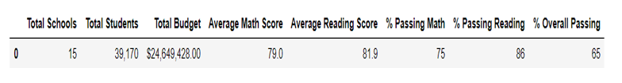
District Summary after the adjustment:
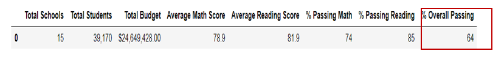
2. Analysis of School Summary before and after the data adjustment:
The overall passing rate of Thomas High School reduced to 65% from 91% due the adjustment.
School Summary before the adjustment:
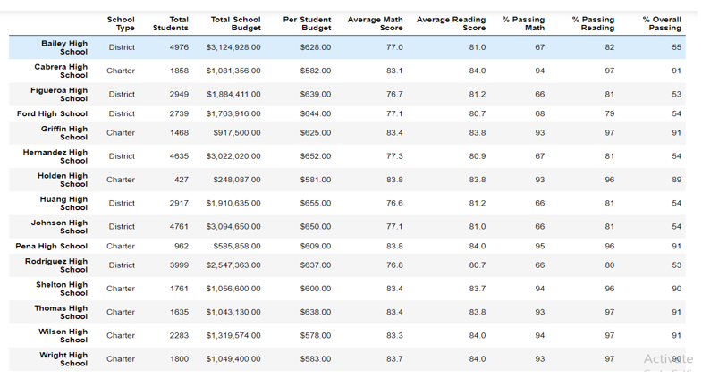
School Summary after the adjustment:
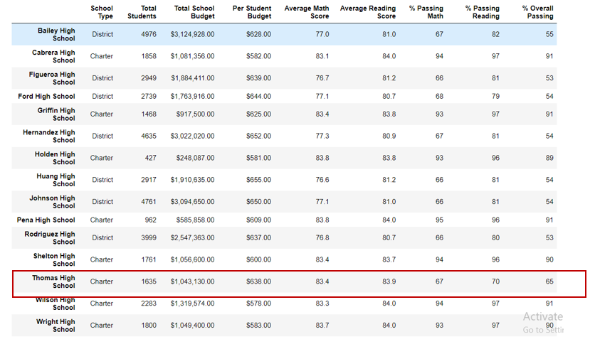
3. Thomas High School’s performance with respect to the other school before and after the data adjustment:
Thomas High School was on the fourth position with respect to the other school. However, after adjustment it moved to the eighth position in comparison to other school. 
Five highest performing school in the district before the adjustment:
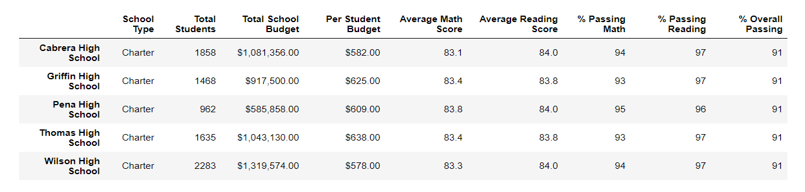

Five highest performing school in the district after the adjustment:
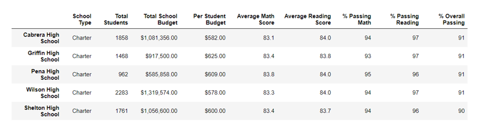
Five lowest performing school in the district before the adjustment:
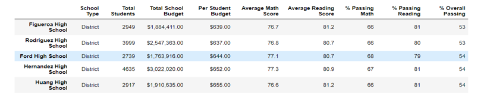
Five lowest performing school in the district after the adjustment:
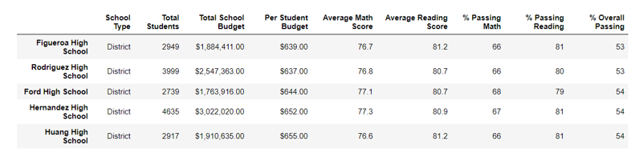
4. Analysis of Math and Reading score by grade before and after the adjustment:
The adjustment did not have any affect on any score except the grade that was adjusted.
Math’s score based on the grade level before the adjustment:
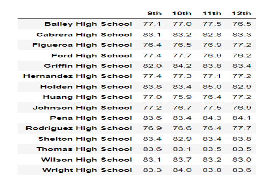
Math’s score based on the grade level after the adjustment:
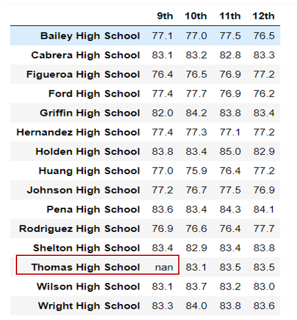
Reading Score Analysis based on grade level before the adjustment:
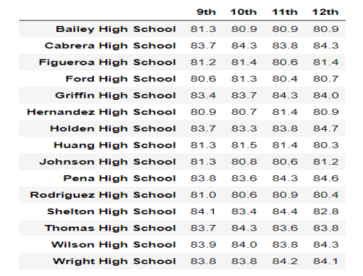
Reading Score Analysis based on grade level after the adjustment:
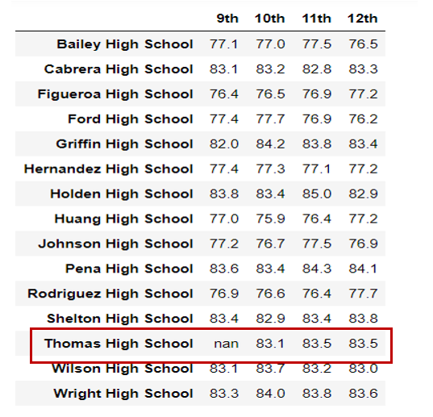
5. Analysis of scores by school spending before and after the adjustment:
The overall passing rate for the spending range $630-644 reduced from 63% to 56% due to the adjustment.
Summary of the Scores based on the school spending before the adjustment:
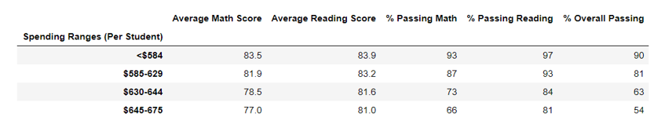
Summary of the Scores based on the school spending after the adjustment: 
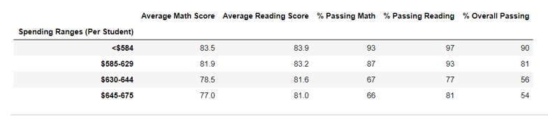
6.Analysis of Scores by School size before and after the adjustment:
  The adjustment also affected the overall passing percentage for the school size based performance.
Summary of the Scores based on the school size before the adjustment 
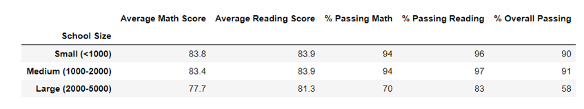
Summary of the Scores based on the school size after the adjustment:
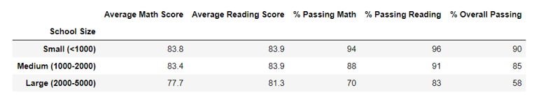
7.Analysis of Scores by School Type before and after the adjustment:
The overall passing score for the charter school reduced as Thomas High is a charter school.
Summary of the scores based on the School Type before the adjustment:
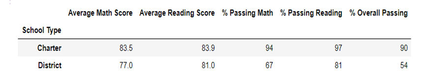
Summary of the scores based on the School Type after the adjustment:
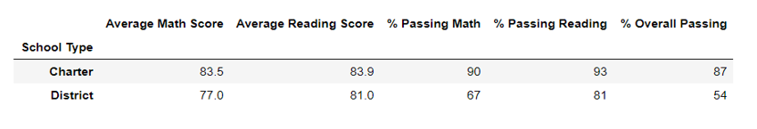
